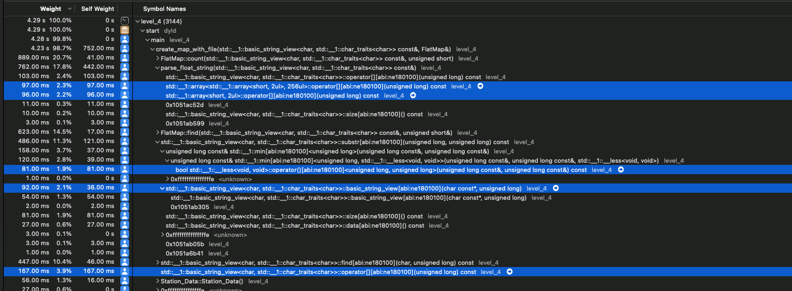

# 1️⃣ 🐝 🏎️ (One Billion Row Challenge)

**1bc** is exactly what it named after. There are 1 billion row of data given in following formate. (city name; Temparature);

```
Hamburg;12.0
Bulawayo;8.9
Palembang;38.8
Hamburg;34.2
St. John's;15.2
Cracow;12.6
... etc. ...
```

And would like to calculate `<min>/<avrage>/<max>` output those in following formate.

```
Hamburg;12.0;23.1;34.2
Bulawayo;8.9;22.1;35.2
Palembang;38.8;39.9;41.0
```

More Details are at 1️⃣🐝🏎️[1BRC](https://github.com/gunnarmorling/1brc)

## Table of Contents

- [Dependency](#dependency)
- [Compiling & Building](#compiling)
- [Input File](#input)
- [How to Run](#run)
- [Optimization levels](#levels)
- [Eureka Found 🤯](#eureka-🤯)
- [License](#license)

#### Dependency

As of 2024 i am running this on Macbook Pro with (2.4 GHz Quad-Core Intel i5) and have 16GB of ram and whole challenge is in C++17 (clang not gcc). Performance would vary if run on different system.


#### Compiling

1. clone the repo `git clone https://github.com/xpd54/1brc.git`
2. update submodule `git submodule update --init --recursive`
3. create a build folder and build `mkdir build && cd build && cmake .. && make`

Whole project is split into 5 different levels. 5th (final) where I use multithreading.

### Input

There is a sample data set `measurements.txt` which have 100K data point. To generate whole data I am using original method which is mentioned [1brc](https://github.com/gunnarmorling/1brc?tab=readme-ov-file#running-the-challenge). (1brc repo is added as submodule in `./input/1brc` this generates 13gb of data so make sure have enough disk space)

### Run

`level_0` to `level_4` execute with `./level_0 <path to measurements.txt>` (measurements.txt from sample or original created from `./input/1brc`)

`final` build uses 3 arguments `./final <path to measurements.txt> number_of_thread <size of data per thread in mb>` (Optimal I have run with 32 thread with 512mb per thread)

```
Total run time
Number Of station:- 413
Number of Thread :- 32
Section Size :- 512
Time Taken in millisecond :- 27440ms
Time Taken in second :- 25s
```

### Levels

| Levels  | Noticeable changes                                                                                                                                         | Notes                                                                                                    | Run Time:-                                                                         |
| :------ | :--------------------------------------------------------------------------------------------------------------------------------------------------------- | :------------------------------------------------------------------------------------------------------- | :--------------------------------------------------------------------------------- |
| level_0 | Baseline implementation. Using `std::ifstream` to read the file <br> and `std::map` to store.                                                              | Making copy of data is expensive.                                                                        | In Millisecond :- 561356ms <br> In Second :- 561s                                  |
| level_1 | Avoid making copy of created map and use `std::unordered_map` <br> which is faster than map.                                                               | Unordered map uses hash table as a data structure <br> compared to tree in map. Which makes it faster.   | In Millisecond :- 319908ms <br> In Second :- 319s                                  |
| level_2 | Using `mmap` to map data file in virtual memory and convert that <br> to `std::string_view`. Avoid using `std::stof`                                       | `mmap` is a system call which maps the file into <br> physical memory space. _Details are in Eureka_     | In Millisecond :- 186700ms <br> In Second :- 186s                                  |
| level_3 | Using custom map which holds key value to an array also using <br>`std::hash` with `uint_16` to get index in array.                                        | Accessing array with pointer arthmetic would be faster.                                                  | In Millisecond :- 179987ms <br> In Second :- 179s                                  |
| level_4 | Using `constexper` to create compile time array<br> to calculate int value from string.<br> Also using simple hash method to avoid `std::hash` completely. | Hash function is slow, I was calculating `uint32_t`<br> size of hash only to convert it into `uint16_t`. | In Millisecond :- 157615ms <br> In Second :- 157s                                  |
| final   | Using multithreading. Split the data files into smaller <br> section and pass it to each thread.                                                           | After running multiple time seems 32 threads <br> with 512mb section size gets best run time.            | In Millisecond :- 27440ms <br> In Second :- 25s <br> Thread :- 32 <br> Size :- 512 |

### Eureka 🤯

[mmap](https://man7.org/linux/man-pages/man2/mmap.2.html)

##### Instruments

In MacOS instruments provide multiple profiling tools. I am using xctrace.

```
xctrace record --output . --template "Time Profiler" --time-limit 10s --launch -- <your_excutable_file> <excutable_args>
```

Compiling in debug mode and running for 10s generates cpu time profile.
Where it's really easy to see where cpu is spending most time. This helped to detect which part to focus and did that actually worked.


### LICENSE

[License](https://github.com/xpd54/1brc/blob/main/LICENSE)
